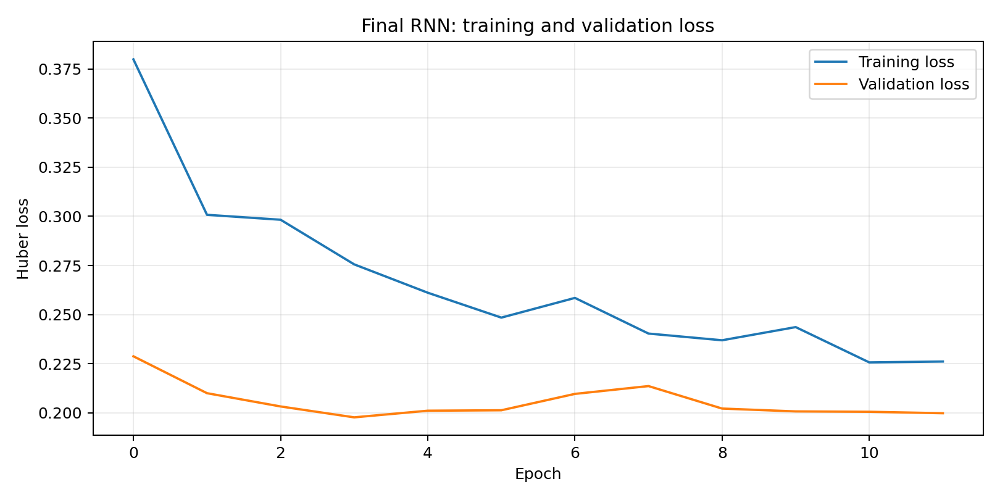
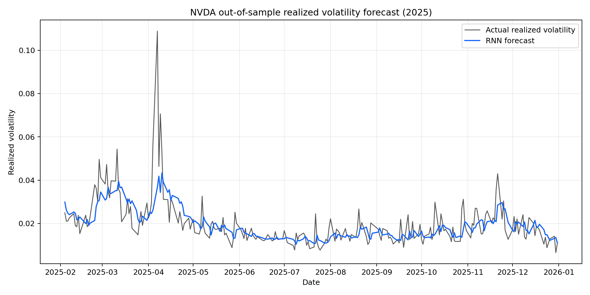

# RNN Realized Volatility Forecasting

This project forecasts NVIDIA's next-day realized volatility with recurrent neural networks. It is a standalone version of my RNN contribution to a broader financial-machine-learning project and intentionally excludes the other group models.

## Project objective

The analysis tests whether an RNN can capture the short-run persistence and clustering found in realized volatility. It compares:

- single-layer and two-layer SimpleRNN architectures;
- a univariate specification based on NVDA volatility history;
- multivariate specifications with a 10-day volatility average and VIX; and
- alternative units, dropout rates, learning rates, and optimizers.

## Modeling approach

| Stage | Implementation |
|---|---|
| Target | Next-day NVDA realized volatility |
| Input window | Previous 21 trading days |
| Feature engineering | Log realized volatility, log 10-day realized-volatility average, and log VIX |
| Time split | 2018-2022 training, 2023-2024 validation, and 2025 test |
| Scaling | Standardization fitted on training data only |
| Architectures | One or two `SimpleRNN` layers followed by dropout and a dense forecast layer |
| Training | Huber loss, early stopping, and deterministic seed 42 |
| Model selection | Lowest validation RMSE; test data is used once for final evaluation |

The standalone implementation makes the forecasting alignment explicit: a prediction dated *t* uses only the preceding 21 observations. This prevents the target day from appearing in its own input window.

## Results

The original model-development run selected a two-layer multivariate RNN using log realized volatility and its log 10-day moving average. The selected tuning values were:

- 32 recurrent units per layer;
- 20% dropout;
- Adam optimizer with a 0.0005 learning rate; and
- a 21-day input sequence.

The published standalone pipeline was rerun end to end after making the one-day forecast alignment explicit. Its verified results are:

| Period | RMSE | MAE |
|---|---:|---:|
| Validation (2023-2024) | 0.007742 | 0.004875 |
| Test (2025) | 0.008087 | 0.004819 |

The original submitted experiment used a different target/sequence convention and reported lower errors. Those values are not presented as directly comparable here; the repository results come from the stricter implementation in the published code. Small differences can still occur across TensorFlow versions and hardware.

### Reproduced diagnostics

| Training history | 2025 test forecast |
|---|---|
|  |  |

The forecast tracks the overall volatility regime but smooths abrupt spikes, which is a common limitation of squared-error-oriented time-series forecasts.

## Reproduce the analysis

Python 3.11 or newer is recommended.

```bash
python -m venv .venv
source .venv/bin/activate
python -m pip install -r requirements.txt

python rnn_realized_volatility.py \
  --rv-data "/path/to/daily_metrics.pkl" \
  --vix-data "/path/to/VIXCLS.xlsx"
```

The default command fits the selected final RNN and writes metrics and figures to `results/`. The VIX file is optional for this final specification because the chosen feature set does not use VIX.

To repeat the complete feature comparison and hyperparameter search:

```bash
python rnn_realized_volatility.py \
  --rv-data "/path/to/daily_metrics.pkl" \
  --vix-data "/path/to/VIXCLS.xlsx" \
  --tune
```

The full search evaluates four feature groups for each architecture, then tunes dropout, learning rate, recurrent units, and optimizer. It can take substantially longer than the default run.

## Repository structure

```text
.
├── rnn_realized_volatility.py   # Standalone RNN workflow
├── requirements.txt             # Python dependencies
├── results/                     # Reproduced metrics and figures
└── README.md
```

## Data and publication note

The realized-volatility dataset, assignment instructions, full group report, and classmates' code are not distributed here because they are course or third-party materials. With authorized access, place `daily_metrics.pkl` and the FRED `VIXCLS` workbook anywhere locally and pass their paths on the command line.

No open-source license has been applied. This repository shares the RNN implementation and its documented results without granting redistribution rights for the underlying course data.

## Reference

Bucci, A. (2020). *Realized Volatility Forecasting with Neural Networks*. Journal of Financial Econometrics, 18(3), 502-531.
